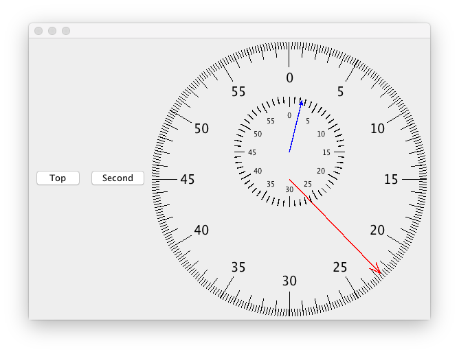

# Stopwatch with Java Swing
A simple stopwatch created from the ground up with Java Swing (tick marks and arrows done in code)



## Compiling and Running the Stopwatch 
Compile by running: 
```
$ javac *.java
``` 
Run the stopwatch by running the generated `AnimationTester.class` file and enter the size of the window you want. E.g. for a window size of 350, run: 
```
$ java AnimationTester 350
```

## Top and Second Buttons
The "Top" and "Second" buttons simulate hitting actual buttons on a stopwatch

Top – Start/pause/resume

Second – Reset (if paused), freeze (if running), unfreeze (if freezed) 
